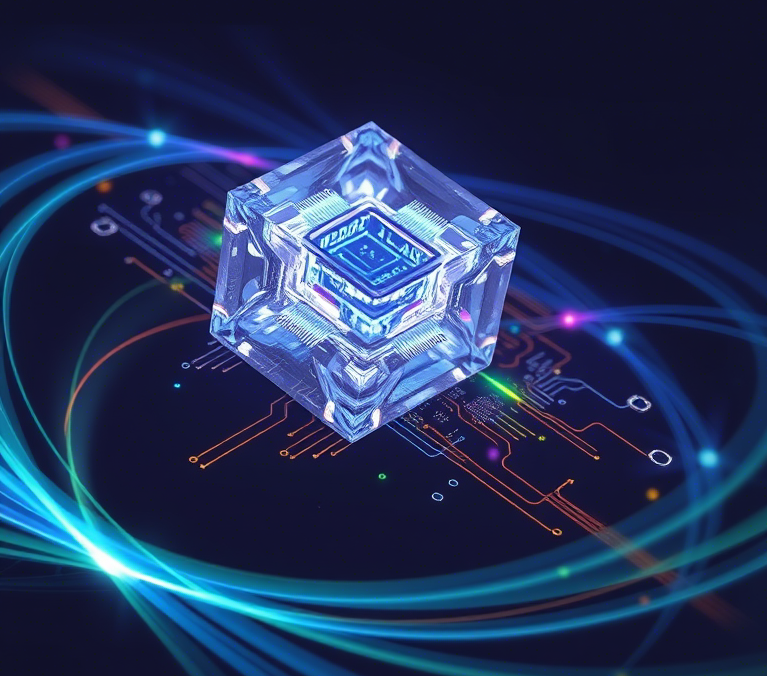

# Fundamentos de Física de Semiconductores

Bienvenido a este libro interactivo sobre física de semiconductores, diseñado como libro de texto para cursos universitarios.

## Acerca de este libro

Este libro ofrece un recorrido completo por los fundamentos físicos de los semiconductores y sus aplicaciones, combinando teoría con visualizaciones interactivas y ejemplos prácticos.

## Características principales

- **Contenido interactivo**: Experimentos virtuales, visualizaciones 3D y simulaciones
- **Enfoque pedagógico**: Progresión desde conceptos básicos hasta aplicaciones avanzadas
- **Orientación práctica**: Conexión entre teoría y aplicaciones tecnológicas actuales
- **Componente computacional**: Integración de herramientas modernas de análisis y simulación

## Cómo usar este libro

Navega por los capítulos utilizando el panel de navegación a la izquierda. Cada capítulo contiene:

- Explicaciones teóricas
- Visualizaciones interactivas
- Ejemplos resueltos
- Ejercicios prácticos